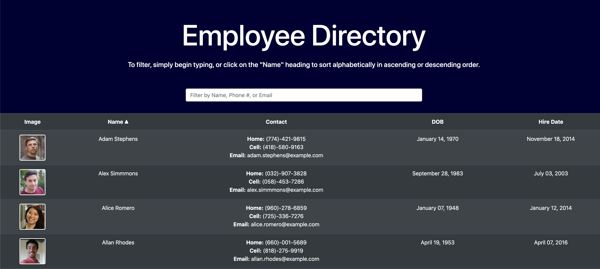

# Employee Directory - React

## TABLE OF CONTENTS
* [Description](#description)
* [Installation](#installation)
* [Usage](#usage)
* [Examples](#examples)
* [Contributing](#contributing)
* [Questions](#questions)

## Description
A single-page application built using React that simulates an Employee Directory using the [Random User Generator API](http://randomuser.me/). Users can quickly filter employees by name, phone number, or email, and can also sort them alphabetically. This allows for quick and easy access to all employee information, including contact information, DOB, and hire date.

## Installation
* Run `npm install` to install dependencies
* Run `npm start` to start the application

## Usage
Use the search bar to filter by name, email, or phone number. Click on the "Name" column header to sort employees alphabetically in either ascending or descending order.

## Examples:
[Deployed Site](https://hardcore-meninsky-5a15cc.netlify.app/) (via Netlify)

Preview:

## Contributing
If you would like to contribute, please open a pull request and include a detailed description with screenshots of the proposed changes.

## Questions?
Please direct all questions to cseibert2667@gmail.com, and be sure to check out my other projects at [cseibert2667](https://www.github.com/cseibert2667).
